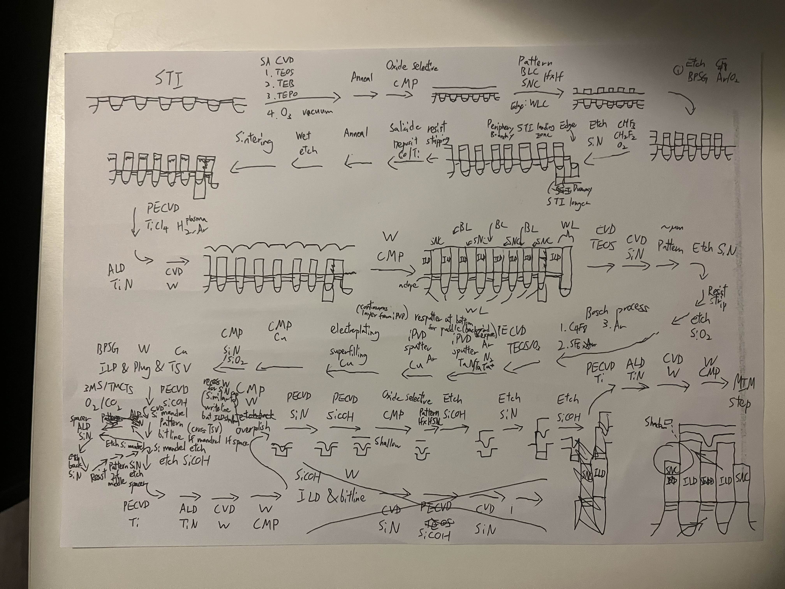
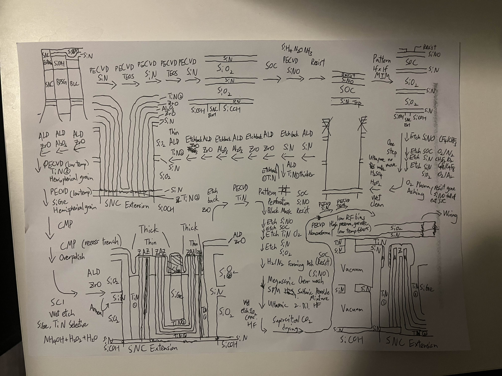

   

# Tiny Tapeout Verilog Project: Distributed Computing with Pong!

### Just watch it in action!

<video src="src/debug_history/checkpoint5_unstable_teleport_after_3/checkpoint5.mp4" controls="controls" width="100%">
</video>
<video src="https://github.com/user-attachments/assets/e9ea9dbf-cc86-4f69-a1a8-7cf9f02c17e4" controls="controls" width="100%">
</video>
<video src="https://github.com/user-attachments/assets/5f583adb-5bea-4dd4-957a-cdc12cdf7bfc" controls="controls" width="100%">
</video>

### Two chips. One game. No seams.

Two chips frankensteined together to act as one.
* The left chip owns the left half.
* The right chip owns the right half.

They talk through wires and pass the ball back and forth like one seamless chip.

Just like AI data centers split math across thousands of processors, these two chips split a game of Pong – passing ball physics between two screens.

## How It Works

The game field is split across two separate chips.

When the ball reaches the edge of one screen, the active chip pauses it and sends its speed and direction to the second chip.

Once the second chip confirms it received the data, it draws the ball and resumes the movement.

The first chip then deletes its copy of the ball. This handshake happens so fast that the two screens look like one single continuous playing field.

| Connection State | Behavior |
| --- | --- |
| Connected | Ball passes seamlessly left ↔ right |
| Disconnected | Ball bounces off edge like a normal wall |
| Reconnect | Right screen ball disappears, left screen keeps playing |

## Why This Matters?

This project is a visual demonstration of distributed computing — multiple computers working together to solve a single problem.

#### But wait, what is the difference from a normal multiplayer game?

* Most multiplayer games use a central server. If the server crashes, the game ends for everyone

* This project is entirely decentralized. There is no main server. Both chips have equal power, see the exact same game world, and cooperate directly with each other.

* This works like **cryptocurrency** – completely decentralized. Both chips see the same game world and agree on what's happening, stitching their screens into one giant seamless display.

### **The Core Principles**

#### 1. No Central Leader (Be Water)
* Both chips run the exact same code and have equal authority.

* Each chip is fully capable of running its own local environment independently if the connection to its partner is lost.

* One chip failure never takes down the whole system.

#### 2. Parallelism (Like AI Chips)
* Instead of one chip doing all the work, two chips split the job evenly.

* Each chip shares real-time results. continuously during gameplay.

* This mimics the same principle powering massive AI chips: splitting work across many smaller processors to solve problems no single chip could handle alone.

#### 3. Automated Self-Healing (By Democracy)
* Disconnected chips preserve local game states internally.

* Reconnection triggers automatic data exchange.

* Merged states rebuild and synchronize the shared world.

* System heals completely without requiring a reboot.

&nbsp;

## Made Possible by Tiny Tapeout

This project wouldn't exist without **Tiny Tapeout** – the platform that makes chip design accessible to everyone.

### The Backstory: From Zero to Silicon

The author learned about chip design at an amazing workshop hosted by [Pat Deegan](https://www.youtube.com/@PsychogenicTechnologies) at [Latch-Up 2026](https://fossi-foundation.org/latch-up/2026) – a conference dedicated to free and open source silicon by ([FOSSi Foundation](https://fossi-foundation.org/)).

The [Tiny Tapeout](https://tinytapeout.com/) workshop showed that anyone can design and fabricate a chip.

* Inspired by that experience and [TinyTPU](https://www.tinytpu.com/) showcase in [Socratica](https://socratica.info/) [Symposium 2026](https://symposium.socratica.info/), the author decided to build something wild: distributed computing on a tiny chip. A proof that parallelism and fault tolerance aren't just for AI data centers – they can run on two crappy frankensteined chips playing Pong.

### **From zero to tapeout in 7 days**

**No prior chip design experience.** Just curiosity, and a stubborn belief that it could be done by a nobody.

For the sake of the author's bigger end goal:

>**Project Yeouibu** - a magical charm inscribed with words that manifest your intentions into physical reality, operating exactly like human-commanded semiconductor technology.
>
>* Building a world-class semiconductor empire in the most underrated smartest city in the world, Waterloo Canada
>
>* Turning it into a beacon of global innovation through a special economic zone initiative.
([Article](https://www.linkedin.com/feed/update/urn:li:activity:7440488589068566529/?utm_source=share&utm_medium=member_desktop&rcm=ACoAAD8EX30BDpb0W0uJlx1NSad0ZRf28OHpHgE))
>   

### **100+ hours of work**

Watching the same sunrise 4 times in the last sprint of the 1 week marathon - **from noobie workshop to tape it out**

The author **self-taught** everything: 

From Distributed Computing, Network Protocols, Signal Processing, Hardware Descriptive Language (HDL), Chip Design, to Game Design. Just by pure thinking!

Fun to learn by doing. Fun to invent solutions from just solving the problem, no terminology, no spoiler. All from pure reasoning.

### If the author can do it, **so can you**.

Whether you want to build AI accelerators, distributed systems, or just play Pong across two chips – Tiny Tapeout is your starting line.

### **Learn. Build. Tape out.**

&nbsp;

# Future Development

#### Many features are planned but couldn't fit due to lack of experience and time. What exists now is the bare minimum – a proof of concept. But the foundation is solid. The potential is huge.

## 1. Scalable Network Chaining with Consensus

The current design supports two chips. The next evolution: **connect as many chips as you want**.

With 8 bidirectional pins, ball and connection status can be condensed into the UART protocol. Each chip can be designed and optimized to talk to all its neighbors using 4 pairs of UART pins.

### Network Topology in TinyTapeOut

With 8 bidirectional pins, each chip can talk to all its neighbors using 4 pairs of UART pins. Each chip builds its local network map based on which pin numbers are connected. By summing the connection numbers reported by its neighbors, each chip calculates a **vote**. These votes are broadcast to everyone, allowing the network to assign unique IDs and build a global map.

**Every chip agrees on who holds the ball and how it's passed – just like cryptocurrency!**

### Consensus Voting with Asymmetric Pin Mapping (The Voting Mechanism)

This is the hard part of distributed computing – building trust among chips so they believe what another chip says is true.

Using my game analogy to illustrate: automatic identification as proof-of-concept showcasing how this can be done in modern AI/data center chips.

Given the constraint that every chip shares identical hardware and software, they cannot identify themselves uniquely. UART pair pin numbers can be utilized to create asymmetry for consensus voting.

Each chip follows the connection rule below to connect with every other chip using **its relative pin pair positions**, creating unique vote values.

| Chip | Pair 1-2 | Pair 3-4 | Pair 5-6 | Pair 7-8 |
|------|---------|---------|---------|---------|
| **A** | B | C | D | E |
| **B** | A | C | D | E |
| **C** | A | B | D | E |
| **D** | A | B | C | E |
| **E** | A | B | C | D |

### How Voting Works (Pin Position = Weight)

During booting iteration, each chip declares a vote – the connection pin number – to every other chip in the network.

| Chip | Pair 1-2 | Pair 3-4 | Pair 5-6 | Pair 7-8 |
|------|---------|---------|---------|---------|
| **A** | B = 1 | C = 2 | D = 3 | E = 4 |
| **B** | A = 1 | C = 2 | D = 3 | E = 4 |
| **C** | A = 1 | B = 2 | D = 3 | E = 4 |
| **D** | A = 1 | B = 2 | C = 3 | E = 4 |
| **E** | A = 1 | B = 2 | C = 3 | D = 4 |

In the next iteration, every chip has received votes from all its active connections. Each chip calculates its **vote sum**:

| Chip | Votes from neighbors | Vote Sum |
|------|---------------------|----------|
| A | B(1) + C(1) + D(1) + E(1) | **4** |
| B | A(1) + C(2) + D(2) + E(2) | **7** |
| C | A(2) + B(2) + D(3) + E(3) | **9** |
| D | A(3) + B(3) + C(3) + E(4) | **13** |
| E | A(4) + B(4) + C(4) + D(4) | **16** |

Each chip broadcasts its vote. All chips collect every vote and sort them:

| Vote | Chip | ID |
|------|------|-----|
| 4 | A | 0 (left edge) |
| 7 | B | 1 |
| 9 | C | 2 |
| 13 | D | 3 |
| 16 | E | 4 (right edge) |

*If there is a tie, both chips join together as a team with the same ID – left as an exercise for the player to figure out team formation with port configuration.*

### The Global Map

Now every chip knows:
1. Who it is connected to
2. What its neighbors are connected to
3. Its position in the local network based on the voted sum

When a chip gets disconnected, it can simply repeat the voting process and re-identify itself from its neighbour local network following the connection rule as a global source of truth, or just reseated from its missing slot of the local network map for a simpler route.

Player could also optimize all of the voting combination to fit more than 5 chips, left as a logic exercise for the player if they have more than 5 players. The author would be impressed if anyone manages to gather so many people to play it.

But this voting mechanism is not just for games. The same logic — chips voting to agree on a shared state — is just a miniature version of how distributed consensus powers real-world systems: missile flight control, particle related processes, and AI data centers. Whether passing a ball, a data packet, or a payload, the principles of trust, verification, and redundancy remain the same.

## 2. ICBM Mechanics

After the infrastructure is done, the next thing is to make the game fun!

As the author spent hefty time and heavily inspired by Maplestory and GregTech (Minecraft mod about real-life industrial processes), the author has been thinking about building a game out of that concept. The next feature: player controls a jet with its own maneuver mechanics. Player can shoot ICBMs with a cooldown to another player's local map through the physics transfer demonstrated in this Pong prototype.

Portals spawn chaotically, indicated by color for connected pairs, where ICBMs are transported from attacker to target dimension (inspired by modern Maplestory boss mechanics). The ICBM bounces indefinitely until it crosses another portal or is destroyed by the player.

If an ICBM is destroyed by another ICBM not originating from that space, it triggers a deadly cross beam (parallel and perpendicular from the destroyed ICBM's trajectory and center), posing danger and penalty to the player. If two ICBMs not originating from local space collide, they form 2 deadly crosses based on the collision direction – introducing chaotic dynamics where players choose between attack and defense. If a player is destroyed, all ICBMs originated by that player disappear until the last man stands.

However, even this minimal proof-of-concept already occupies two tile spaces on Tiny Tapeout. While full ICBM mechanics are unlikely to be implemented, the core system already demonstrates the fundamental distributed computing concept that powers massive AI clusters.

&nbsp;

# This Project as Distributed Computing Proof-of-Concept

This seemingly simple Pong game is more than just a game. It demonstrates the same principles that drive massive AI data centers – scaled down to two tiny chips connected by jumper wires.

| Principle | AI Data Center | This Pong Game |
|-----------|----------------|----------------|
| **Chip-to-chip trust  (Shared State)** | Thousands of GPUs agree on massive weight updates using consensus algorithms like Raft or Paxos to prevent split-brain scenarios | Two chips negotiate who has the real ball |
| **Fault tolerance (Graceful Degradation)** | A single failed node cannot kill a 100-day training run. Frameworks use asynchronous gradient descent or local micro-checkpoints so the rest of the cluster keeps computing | Disconnecting allows local, independent gameplay to continue. |
| **Self-healing (Dynamic Re-Clustering)** | Modern orchestrators use automated hot-swapping and health-check loops. When a node recovers, it automatically pulls the latest state from neighbors and catches up | Reconnecting automatically rebuilds and resynchronizes the game world. |
| **Decentralized consensus (Homogeneous Nodes)** | Scalability relies on massive arrays of identical accelerator nodes. Uniformity ensures predictable latency, deterministic math, and symmetric workloads | Both chips run identical hardware and software. No master. No slave |

Scaling from two chips playing Pong to ten thousand chips training AI illustrates the same concept: the physics may change, but the underlying principles remain constant.

However, scaling software is only half the challenge. The movement of data between chips introduces the true bottlenecks.

## Beyond a Silly Game: The Future of Chip-to-Chip Communication

Distributed computing relies heavily on chip-to-chip communication. In AI and data center chips, the main constraints are **power** and the **shoreline** — the physical edge where massive amounts of parallel data enter and exit the chip.

In this demo, the interconnect is simply jumper wires between bidirectional pins on a PMOD socket. Modern chips, however, rely on ultra-fine copper traces or optical transceivers, which are already approaching their physical limits.

## Where the Industry is Today

To overcome these constraints, the industry is transitioning toward **Co-Packaged Optics (CPO)**, which integrates optical routing components directly into the chip package — minimizing the physical distance between computation and communication.

> Transition between co-packaging optics, image [*source*](https://www.youtube.com/watch?v=Xt-GY8Pkt6g) [1]

> Key trending of co-packaging optics, image [*source*](https://www.idtechex.com/en/research-report/co-packaged-optics-cpo/1138) [2]

The architectural roadmap is clear: **Pluggable modules → ASIC → Direct Substrate Integration**

### The Problem: Neither Copper Nor VCSEL Scales to Sub-THz

To achieve sub-THz data rates, we must evaluate the limitations of the two dominant interconnect technologies used today.

> Data center interconnect map, image [*source*](https://www.asteralabs.com/the-400g-per-lane-inflection-point-where-copper-and-optical-meet-in-ai-infrastructure/) [3]

## Copper

> Copper vs Optics, image [*source*](https://photoncap.net/p/pc101-lecture-1-why-silicon-photonics) [4]

While copper is a cost-effective and reliable solution for short-reach signaling, it hits a rigid physical wall at **400G per lane** [3], rendering it incapable of supporting sub-THz frequencies. **Beyond 200G per lane, signal quality degrades exponentially** due to the AC skin effect, As current becomes confined to this thin outer layer, microscopic surface roughness forces it to travel a longer effective path, significantly increasing AC resistance [5].

Even worse, once the signal leaves the die, the plastic packaging and circuit board materials absorb high-frequency energy and turn it into **heat**. At sub-THz speeds, the wires themselves **act like a filter that kills the signal**, or worse, like antennas that broadcast noise everywhere [6]. This is why optical fibers are so attractive: **light has no electrical charge, so signals don't interfere with each other. Copper simply cannot go faster without burning too much power**, needing complex electronics, or turning into a radio transmitter.

## VCSEL

> VCSEL, img [*source*](https://www.brandnewdiode.com/news/what-is-vcsel-77140908.html) [7]

**VCSELs** (Vertical-Cavity Surface-Emitting Lasers) are the industry standard for optical transceivers. They convert electricity to light using tiny lasers embedded in the chip. But this approach has deep flaws.

**While VCSELs is highly reliable within hot-swappable pluggable modules** [8], integrating VCSELs directly onto a high-performance compute substrate introduces **significant architectural vulnerabilities**. A single laser failure ruins the entire multi-thousand-dollar ASIC package, bricking the entire computation module and cause unacceptable system downtime. Because of this fatal manufacturing and deployment risk**, next-generation infrastructure roadmaps stop short of placing VCSELs directly on the processor die. Instead, **architects keep these optical arrays isolated at the near-ASIC or Near-Package Optics (NPO) boundary** [9].

> Near Packaging Optics (NPO) VCSEL, image [*source*](https://www.broadcom.com/blog/beyond-the-copper-wall-scaling-ai-clusters-with-vcsel-based-near-package-optics-npo-) [9]

> VCSEL principle, img [source](https://inphenix.com/vcsel-vertical-cavity-surface-emitting-laser-principles-advantages-applications-and-future-trends/) [10]

Furthermore, the process of direct modulation introduces severe performance bottlenecks at high operational speeds. To encode digital data, the injection current must be cycled rapidly up and down to alter the charge carrier density within the central active layer. This direct injection forces rapid electron-hole recombinations, turning the electrical pump current into an amplified optical signal via stimulated emission. However, rapidly toggling this injection current alters the internal carrier density and localized temperature of the active region, which dynamically shifts the semiconductor’s refractive index. Because the optical length of the cavity changes with the refractive index, the laser cannot maintain a pure color, resulting in severe wavelength chirp. This dynamic color shifting causes the optical pulses to spread out and blur via chromatic dispersion, rapidly degrading signal integrity over fiber runs.

Worse, the physical design required to build these vertical lasers introduces a fundamental RC parasitic bottleneck that prevents fast switching. To bounce light vertically, VCSELs require dozens of alternating, planar Distributed Bragg Reflector (DBR) mirror layers grown parallel to the substrate. Forcing the modulation current to flow vertically through these numerous material interfaces creates high internal series resistance. Simultaneously, to make the laser efficient, the current must be squeezed through a microscopic oxide confinement aperture. Sandwiching this thin insulating oxide layer between highly conductive p-type and n-type semiconductor regions creates a parallel-plate structure that traps a massive amount of parasitic capacitance.

In short, VCSEL suffer **severe wavelength chirp** and **RC parasitic bottlenecks** from their fundamental physics [11], forming a structural low-pass filter that rounds off sharp digital pulses. This restricts them to binary or basic PAM4 signaling, capping single-lane speeds in **200Gb/s PAM4** [12], well below the sub-THz data rates required by next-generation links. Structurally, because VCSELs consist of alternating, planar DBR mirrors grown parallel to the substrate, they emit light vertically. This vertical profile prevents them from cleanly coupling into flat, planar photonic waveguides without complex, high-loss 90-degree turning mirrors. This geometric mismatch, combined with their **inability to support high-density Wavelength Division Multiplexing (WDM) in a single bus waveguide** [13], establishes VCSELs as an **inadequate, short range solution**.

**If anyone wants to build the next generation of interconnect, photonics is not an option – it becomes a necessity. But VCSELs are not the answer.**

# The Author's Research

This project evolved from a workshop concept to final tapeout in a single, intense one‑week sprint from nothing. Rather than marking an endpoint, this milestone marks the beginning of exploring substrate-level optical interconnects. After getting it taped out, the author will gain hands-on experience building optical communication systems — from simple jumper wires to full photonics — with the goal of creating a scalable platform capable of **revamping the backbone of chip interconnects** through massively parallel optical links operating at sub-THz bandwidth densities for intermediate- to long-distance data transfer.

The long-term vision is a vertically integrated Electronic-Photonic Integrated Circuit (EPIC) platform that scales from chip-to-chip communication to rack-scale optical compute fabrics for future AI accelerators, chiplets, and hyperscale datacenter systems.

> Illustration of AI center, image [*source*](https://picmagazine.net/article/123086/Giving_AI_room_to_grow_with_ultra-compact_silicon_modulators) [14]

> Next Generation of vertically integrated Electronic-Photonic Integrated Circuit, image [*source*](https://www.imec-int.com/en/next-generation-silicon-photonics) [15]

Unlike conventional electrical interconnects or VCSEL-based optical links, the author proposes an architecture that **completely separates optical generation from modulation**, preserving the CMOS compute substrate for core logic operations. Optical generation is moved entirely off-chip using an external multi-wavelength frequency comb source, while on-chip modulation occurs through nonlinear electro-optic resonators.

A highly refined optical spectrum, consisting of evenly spaced frequency lines within the C-band (1530-1565 nm), is injected into the package via photonic wire bonding (PWB). The wavelengths are routed into on-chip arrays of Microring Resonators (MRRs) fabricated from advanced nonlinear electro-optic materials such as Thin Film Lithium Niobate (TFLN) and Barium Titanate Oxide (BTO). Each MRR resonates at a specific wavelength, enabling independent high-throughput optical channels.

> Author proposed design, img [source](https://arxiv.org/abs/2506.12962) [16]

Modern high-performance optical interconnects rely on VCSELs for short-reach links due to mature manufacturing, low cost, and ease of array integration. State-of-the-art VCSEL systems currently reach 200 Gb/s PAM4 per lane [11], but further scaling is limited by thermal effects, its fundamental physics, and electrical signaling constraints.

This architecture takes a fundamentally different approach.

Rather than directly modulating the laser, the external laser source remains continuously active while modulation occurs entirely through voltage-controlled refractive index changes in MRRs. All optical power originates from the off-chip frequency comb, which simplifies thermal management and eliminates laser turn-on latency and modulation dead-time. **Optical generation and optical modulation become physically separated systems**.

### Frequency comb

> Optical Frequency Comb, by KRISS: Korea Research Institute of Standards and Science (KRISS), img [source](https://phys.org/news/2025-07-optical-frequency-absolute-distance-precision.html) [17]

Placing the high-performance frequency comb in a thermally optimized environment enables stable, high-quality operation [11]. Key benefits:

- **Thermal isolation**: Laser heat is decoupled from the chip substrate, reducing thermal bottlenecks common in VCSEL systems
- **Process compatibility**: Externalization avoids integration issues with CMOS substrates
- **C-band deployment**: Supports 1530–1565 nm wavelengths, minimizing signal loss and channel crosstalk over extended distances

> C band frequency comb source, img [source](https://doi.org/10.1109/JLT.2021.3101816) [18]

Under stable temperature conditions, the frequency comb produces multiple evenly spaced wavelengths, which are injected into the substrate through photonic wire bonding (PWB) and routed into a shared bus waveguide for distribution to MRR arrays [18].

By removing on-chip laser generation, this architecture enables higher-speed, lower-power optical communication and decouples laser thermal management from chip thermal management.

### Photonic Wire Bonding (PWB)

> Photonic wire bonding (PWB), img [source](https://www.photonics.com/Articles/Photonic-Wire-Bonding-Using-Lasers-to-Integrate/a68136) [19]

PWB serves as the optical interface between the external frequency comb source and the integrated photonic die. Unlike conventional packaging, which requires nanometer-scale fiber alignment, PWB bypasses these mechanical limitations.

Traditional approaches for optical interfacing rely on:

* active alignment,
* passive V-groove structures,
* machine-vision assembly,
* wafer-level epitaxial integration.

In contrast, PWB uses **two-photon polymerization lithography** to fabricate freeform, three-dimensional polymer waveguides directly between optical interfaces after component placement [20]. This approach enables:

* Gradual adiabatic optical transitions, reducing coupling loss
* Tolerance to much larger packaging offsets compared to conventional edge coupling
* Dense 3D optical routing across chiplets and substrates [21]

> Photonic wire bonding (PWB) zoomed, img [source](https://pubs.aip.org/aip/app/article/10/2/026107/3334317/High-power-and-narrow-linewidth-laser-on-thin-film) [22]

The PWB functions as a custom optical bridge for:

* External frequency comb → PWB → Bus waveguide
* Bus waveguide → PWB → external fiber
* Chip-to-chip optical interconnects

> Photonic wire bonding (PWB) for chip to chip communication, img [source](https://www.photonics.com/Articles/Photonic-Wire-Bonding-Using-Lasers-to-Integrate/a68136) [20]

Because the optical mode expands gradually through the polymer taper, mode mismatch losses are substantially lower than conventional edge coupling. This architecture also enables dense 3D optical routing necessary for future disaggregated compute systems, where optical I/O must scale across many heterogeneous chiplets simultaneously [21].

### Microring Resonator (MRR) Physics

> Micro-Ring Resonators (MRRs) for Wavelength Division Multiplexing (WDM), by Intel, img [source](https://www.uceics.com/intel-showcases-a-photonics-first-an-eight-wavelength-laser-array/) [23]

At the center of the architecture is the MRR, which functions as a wavelength-selective optical cavity.

Each ring sits adjacent to a shared straight bus waveguide. Light propagating through the bus waveguide couples evanescently into the ring when the optical wavelength satisfies the cavity resonance condition [24].

> Evanscent coupling, video [source](https://www.youtube.com/watch?v=4O-1CJx4s4w) [25]

> [Full video of Evanscent coupling between straight waveguide and a microring resonator](https://www.youtube.com/watch?v=_OlW0hP9rX8) [26]

$$
m\lambda = n_{\text{eff}}L
$$

Where:
* $m$ is the resonance mode number
* $\lambda$ is the resonant wavelength
* $n_{\text{eff}}$ is the effective refractive index
* $L$ is the optical round-trip length of the ring

When resonance occurs, constructive interference causes the optical field to build coherently inside the cavity after every round trip, trapping the wavelength through resonance.

<video src="1StraightWaveguide1MRR.mp4" controls="controls" width="100%">
</video>
<video src="https://github.com/user-attachments/assets/ab7ec895-7bc3-44ab-92f8-eb0b8b89a59e" controls="controls" width="100%">
</video>

> Evanscent coupling and resonance between straight waveguide and a microring resonator, video [source](https://www.comsol.com/blogs/calculating-the-spectral-properties-of-an-optical-ring-resonator) [27]

Under resonance:

* Light couples strongly into the ring
* Transmission through the bus waveguide drops
* The optical channel represents a logical OFF state

When resonance is broken:

* Light no longer couples efficiently
* Optical power remains in the bus waveguide
* The channel represents a logical ON state

> Toggling optical channel signal with microring resonator, img [source](https://ayarlabs.com/glossary/micro-ring-resonators/) [28]

### Pockels Effect for Ultra-Fast Optical Modulation

The resonance condition of a MRR can be dynamically shifted by changing the refractive index of its material through the linear electro-optic effect, also known as the **Pockels effect** [29].

In non-centrosymmetric crystals, nonlinear electro-optic materials such as TFLN and BTO exhibit strong electro-optic coefficients [30]. When an electric field is applied, the refractive index changes nearly instantaneously through two mechanisms:

* **Electronic response** – sub‑femtosecond polarization of bound valence electrons [31].
* **Ionic response** – sub‑picosecond lattice displacements [32, 33].

Together, these effects enable the refractive index on femtosecond to sub-picosecond timescales:

$$
\Delta n = -\frac{1}{2} n^3 r E
$$

Where:
* $r$ is the linear electro-optic (Pockels) coefficient
* $E$ is the applied external electric field

Because resonance depends directly on effective refractive index, even a very small Δn shifts the resonant wavelength:

$$
\Delta \lambda = \lambda\frac{\Delta n_{\text{eff}}}{n_{\text{g}}}
$$

Where:
* $\Delta \lambda$ is the resonant wavelength shift
* $\lambda$ is the operating wavelength

#### Picosecond-Scale, Frequency-Flat Modulation

A defining property of the Pockels effect is that the electro‑optic coefficient r remains essentially constant across a wide frequency range. Experimentally, r in lithium niobate (LiNbO₃) has been shown to be constant from 100 MHz to at least 330 GHz [34]. Theory predicts that this frequency-flat behavior can extend into the sub-THz regime, because r is dominated by near-instantaneous electronic polarization rather than by the slower motion of free carriers [31].

When an electric field is applied:

* Bound electrons shift relative to nuclei on femtosecond timescales, far faster than any RC, carrier transport, or recombination delays [31]
* Modulation efficiency ($\frac{dn}{dV}$) remains constant even at sub-THz drive frequencies [35]
* High electro-optic coefficients (30–900 pm/V in modern nonlinear materials) enable sub-volt switching [30, 36]

The resonance of a MRR shifts according to changes in refractive index [29]. This allows light to be shuttered on picosecond timescales [33, 34], achieving modulation speeds beyond the limits of carrier-based silicon photonics or VCSEL systems [12, 23, 37-39].

#### Implications for Photonic Interconnects

By combining high-speed, sub-voltage modulation with direct CMOS integration [39], the Pockels effect enables:

* Sub-THz modulation without RC or carrier bottlenecks [29, 31, 34]
* Picosecond-scale shuttering of light through MRRs [39]
* Dense wavelength channels on a single waveguide without interference [23, 38]
* Low-energy-per-bit signaling via sub-volt operation [39]
* Simplified system architecture through direct integration with CMOS [39]

In essence, the Pockels effect achieves picosecond-scale optical modulation [33, 34], making it ideal for **next-generation, ultra-dense optical interconnects with minimal signal distortion** [23, 38, 39].

### Dense Wavelength Division Multiplexing (DWDM)

To fully exploit the bandwidth potential of MRRs, precise engineering of the Free Spectral Range (FSR) , which determines the spacing between adjacent resonant modes, and the Full Width Half Maxmium (FWHM), which defines the resonance linewidth, is critical [29]:

$$
\text{FSR} = \frac{\lambda^2}{n_{\text{g}}L}
$$

Where:
* $\lambda$ is the operating wavelength
* $n_{\text{g}}$ is the group index
* $L$ is the ring circumference

Smaller rings produce larger FSRs, spacing resonances farther apart and reducing the risk of overlapping channels. This is critical for fitting more independent wavelength channels on a single waveguide. At the same time, the FWHM of each resonance must be carefully controlled: too narrow increases thermal sensitivity and requires precise wavelength alignment, while too wide leads to inter-channel crosstalk [29].

However, smaller rings also introduce tighter bends, which increase optical bending losses and can degrade Q-factors, creating a trade-off between resonance spacing and optical efficiency. Larger rings reduce bending losses but shrink the FSR, limiting the number of non-overlapping channels. Optimal MRR design therefore requires balancing ring size, FSR, and FWHM to maximize channel density while maintaining acceptable optical performance [29].

Even with carefully engineered FSR and FWHM, ultra-dense MRR arrays are highly sensitive to thermal fluctuations, as all photonic materials exhibit a **thermo-optic coefficient (TOC)** [30]:

$$
\frac{dn}{dT}
$$

Resonance frequencies shift as the refractive index changes with temperature. These shifts can produce crosstalk, channel drift, resonance overlap, and inter-symbol interference — issues that become increasingly significant as channel density increases to maximize parallel data throughput. In dense arrays, microrings act as tightly coupled thermal-optical-electrical systems rather than isolated photonic devices [29].

#### Athermal Ring Engineering

> Athermal TFLN MRR with TiO2 cladding, img [source](https://ayarlabs.com/glossary/micro-ring-resonators/) [40]

To stabilize resonances, the architecture incorporates athermal engineering and integrated microheaters. Athermal resonators combine materials with opposing TOCs to minimize resonance drift by geometrically engineering the MRR cross-section to balance opposing TOCs, reducing net resonance drift [40, 41]:

$$
\frac{d\lambda}{dT} \approx 0
$$

This athermal design passively minimizes resonance drift under normal substrate heating. In experimental, temperature‑induced wavelength shifts can be reduced to well below 1 nm over typical operating temperature ranges [40].

To handle fabrication variations and enable dynamic wavelength control, integrated microheaters provide additional tuning, allowing [42-44]:

* Post-fabrication calibration
* Dynamic wavelength locking
* Compensation for process variation
* Adaptive thermal stabilization

These passive and active approaches ensure that DWDM channels remain precisely aligned, maintaining stable operation across all wavelengths in the system.

#### Integration Challenges

Despite the sophisticated electrode design, athermal structures, and DWDM engineering, scaling ultra-dense MRRs remains a formidable challenge. Thermal management, electrical crosstalk, and optical interference must all be balanced simultaneously, requiring sophisticated system-level co-design of materials, device geometry, and circuit architecture [45].

Selecting the appropriate nonlinear electro-optic platform is critical. The material must combine a strong Pockels coefficient, thermal stability, process compatibility, and manufacturability to enable scalable, high-performance MRR arrays [45].

While technically demanding, these efforts are justified: by decoupling optical generation from modulation and leveraging DWDM, these systems can surpass conventional interconnect approaches in bandwidth, energy efficiency, and scalability, unlocking next-generation chip-to-chip and rack-scale optical links for AI accelerators and hyperscale datacenters.

### Thin Film Lithium Niobate (TFLN) vs Barium Titanate Oxide (BTO)

Two leading nonlinear electro-optic platforms are Thin Film Lithium Niobate (TFLN) and Barium Titanate Oxide (BTO), each with distinct material properties, thermal behavior, and fabrication constraints:

| Property | Thin Film Lithium Niobate (TFLN) | Barium Titanate Oxide (BTO) |
| :--- | :--- | :--- |
| **Linear electro-optic coefficient ($r$)** | 30.9–32.6 pm/V [30] | 105–1300 pm/V [30] |
| **Curie temperature ($T_C$)** | 1140 °C | 120 °C |
| **Thermal conductivity (bulk)** | ~5.6 W/(m·K) [46, 47] | 4.05 W/(m·K) [48] |
| **CMOS compatibility** | Excellent (heterogeneous integration, 200 mm/300 mm foundry compatible) [30] | Demonstrated (300 mm process via MBE, but research‑scale) [49, 50] |
| **Optical loss (waveguide)** |	0.23 dB/cm (wafer‑scale) [51] |	0.32 dB/cm [52] |
| **Fabrication maturity** | Commercial pilot phase; HVM partnership [53-55] | Research‑exclusive [50, 56] |
| **Wafer & Foundry availability** | 10+ commercial MPW services worldwide | Research‑scale only; Access via direct collaboration |

**TFLN** has reached commercial pilot production across multiple global fabrication sites, supported by open Multi-Project Wafer (MPW) services [30, 53-55]. It features high thermal conductivity, low optical loss, and strong process compatibility [30].

Market access remains restricted because lithium niobate (LiNbO₃) is chemically inert and requires specialized processing beyond standard CMOS photonics workflows [30, 57–60]. Fabrication must employ dedicated etching and integration techniques, such as Ar-based reactive ion etching [30, 57, 58], atomic-layer etching using H₂/SF₆/Ar plasmas [59], or Br-based plasma [60], which limit widespread availability and necessitate specialized equipment.

**BTO** remains research-exclusive, available only at a few advanced research sites worldwide [50, 56], completely lacking open MPW services. It delivers better efficiency with lower switching voltage compared to TFLN [30].

However, market access is even more restricted because high-uniformity BTO thin films are not commercially available. Fabs must deploy atomic-layer-precise Molecular Beam Epitaxy (MBE) [56, 61] or specialized off-axis sputtering [62] to minimize lattice defects, while BTO suffers from integration challenges due to its low Curie temperature (120 °C) and currently exhibits higher optical loss, limiting device performance.

In summary, **TFLN represents the most mature, commercially accessible platform today**, making it ideal for this application. BTO offers efficiency, but its restricted manufacturing and thermal limits confine it to specialized research, leaving industrial scaling an open challenge.

### Monolithic EPIC Integration

To minimize the path from transistor to optical data transfer, the photonic layer is wafer-bonded directly onto the CMOS Back-End-of-Line (BEOL), forming a vertically integrated EPIC. 

> Monolithic integration of Electronic and Photonic Integrated Circuit, img [source](https://photoncap.net/p/pc101-lecture-1-why-silicon-photonics) [4]

> Monolithic integration of Electronic and Photonic Integrated Circuit with component, img [source](https://photonicsreport.com/blog/the-fascinating-relationship-between-photonics-and-electronics/) [63]

Unlike copper lines that require physical wire duplication or VCSEL arrays that require distinct laser diodes per channel, this architecture scales **spectrally** – more wavelengths, more bandwidth, all in a single waveguide [23, 38].

Operating in the C-band (1530–1565 nm), these dense wavelength channels can propagate over chiplet-scale to intermediate datacenter distances with low loss [64], establishing a practical pathway toward sub‑THz optical interconnects for AI accelerators and hyperscale systems.

## Bidirectional Optical Architecture

**The author's next goal is to reconstruct the underlying communication physics using this TinyTapeout project as a minimal viable optical interconnect demonstrator.**

The system operates as a fully bidirectional optical link:

* Both chips' PMOD sockets interface with external drivers and transimpedance amplifiers (TIAs)
* Custom PICs with TX/RX MRR arrays connect via wire bonding
* Multiple wavelength channels are coupled into each PIC via a grating coupler, providing bidirectional optical channels on the same bus waveguide

**Wavelength allocation example:**

| Direction | Wavelengths | Path |
|-----------|-------------|------|
| Chip B → A | λ₁, λ₃, λ₅, λ₇ | Chip B TX (pins 2,4,6,8) → Chip A RX (pins 1,3,5,7) |
| Chip A → B | λ₂, λ₄, λ₆, λ₈ | Chip A TX (pins 2,4,6,8) → Chip B RX (pins 1,3,5,7) |

All wavelengths share the same optical waveguide simultaneously. Because communication occurs in separate wavelength domains rather than separate electrical lanes, **true full-duplex operation** is achieved without electromagnetic interference.

<video src="MicroringResonatorVideo.mp4" controls="controls" width="100%">
</video>
<video src="https://github.com/user-attachments/assets/af563e31-510f-414c-9099-f0d69ada206b" controls="controls" width="100%">
</video>

> Laser injection to chip scale MRR, video [source](https://actu.epfl.ch/news/a-micro-ring-resonator-with-big-potential-5/) [65]

While custom CMOS electronics can already be fabricated via TinyTapeout, the author has no access to photonic fabrication. This motivates a DIY approach through [HackerFab](https://www.waterloofab.com/), an open-source semiconductor fabrication community. Since the missing components are primarily passive micron-scale photonic devices, the current HackerFab toolchain could be further developed to adapt the fabrication of silicon nitride (SiN) MRRs using carrier-based modulation. While SiN does not support the Pockels effect, carrier injection or depletion enables refractive index tuning and wavelength modulation. Although this approach has slower speed and higher voltage requirements compared to TFLN/BTO, it provides an alternative platform for demonstrating fundamental optical interconnect concepts such as resonance coupling, and DWDM within a TinyTapeout-compatible, DIY photonic fabrication workflow.

The long-term vision: a substrate-level optical interconnect fabric scaling from chip-to-chip links to rack-scale sub‑THz compute systems.

## The Vision

This architecture combines five key elements to overcome VCSEL and electrical signaling limits:

1. **Externalized optical generation** – heat stays off-chip
2. **Nonlinear electro-optic modulation** – picosecond switching, no laser dead-time
3. **Ultra-dense wavelength multiplexing** – more channels per waveguide
4. **Advanced packaging** – photonic wire bonding, monolithic integration
5. **Vertically integrated EPIC fabrication** – CMOS and photonics on one die

As AI accelerators and datacenters demand ever-greater bandwidth, photonic interconnects are becoming essential.

However, as of the current date of writing, **no commercial foundry offers vertically integrated fabrication of advanced CMOS logic with nonlinear electro-optic materials**. TFLN is produced in specialized photonics foundries or as separate chiplets [53-55], while BTO remains research‑exclusive with no commercial production‑compatible solution available [50]. Realizing this architecture therefore requires building a dedicated fab capable of heterogeneous integration with tight photonic-electronic alignment and iterative process development, enabling scalable, high-performance optical interconnects from chip-to-chip to rack-scale. Pioneering such a facility establishes a practical pathway to sub‑THz data transfer, reduces time-to-experiment for new designs, accelerates prototype cycles, and is why these architectures are attracting growing attention in both academia and industry.

---

### A Word from the Author

Click to expand

The author has been working on this project alone and has run into many life issues. Nobody believed a "nobody" and also would be crazy enough to attempt for a fight for world-class semiconductor empire. So the author just bite the bullet and see how far it goes until getting lost in the street.

This silly Pong game? It's a stupid prototype. A desperate attempt to prove that this could work. To convince people that one person who is incompatible with life can churn out something real from 100+ hours within a week with no food, water, and sleep.

The goal of this paper serves as a yeouibu for his project to proceed, as the technical part is always easier than the human part. The author has had a hard time talking and working with humans his entire life and could not brute-force a fix for it. The author just does whatever he can to brute-force the part he can manage. If the author had gotten this project going 3 years ago before his birthday when he was bleak, it might have fixed all of his life's problems. But now, the golden era is in the past. The author will just take whatever it takes from nothing to force its way out.

As there is only a slim chance of getting any working hands, and the author doesn't know how to build a functional team without establishing a codependency that involves 24-hour attention, the project assumption is based on the author going solo all the way to the end without any external help. This project and the author have been inspired by maplestory, [gregtech](https://greglore.miraheze.org/wiki/Main_Page), breaking bad, [hackerfab](https://docs.hackerfab.org/home), tower of god, and Dr. Semiconductor's fab in a shed [video](https://www.youtube.com/watch?v=HfSO-LCKmrA). As a desperate attempt at how one man with nothing but himself is able to get out under a rock to reach into the deity realm. It is the ultimate manifestation of what happens when a socially contained group with nothing to do with life transgresses out to wreak havoc on the meta. In a quest to pursue knowledge of the universe, the author was crusaded by a board of professor in a department meeting, risking his graduation when author was trying to audit every course available in the university with 400+ annoying spam emails, just try to fully utilizing university resources during covid.

**If you're interested – even just curious – I'd love to chat.**
Connect with me on [LinkedIn](https://www.linkedin.com/in/timllh/).

#### Author's Current Task list

| Task | Status |
|------|--------|
| Athermal MRR Array Simulation and Component Integration Optimization | On Hold |
| 7nm CMOS FinFET Process [CAD Modeling](https://cad.onshape.com/documents/391d1465c77e409ce11d0542/w/4c1477bce20b74aae019f360/e/4d678d38a66ef595b6668804) | On Hold |
| DRAM Process [CAD Modeling](https://cad.onshape.com/documents/a5bdfe7155a9c30d78a06951/w/7497dcf7f196195f860859c6/e/57f4ddbb05d26e6cae023db0?renderMode=0&uiState=6a0695b865762f18dd10f743) (Co-Developing In-Game DRAM Process Recipes for [SuperSymmetry](https://susymodpack.substack.com/p/3-circuit-overhaul)) | Work in Progress |
| Complete Circuit Design for the EPIC | On Hold |
| Develop Minimal Viable Layout Schematics of the EPIC | On Hold |
| DIY Silicon photonic interconnect with Hackerfab process | Ideation |
| [**2026 Chipathon**](https://sscs.ieee.org/technical-committees/tc-ose/sscs-pico-design-contest/) | Current next task |

#### Related Work: In-Game Semiconductor Fabrication

As part of the author's ongoing game development work for [SuperSymmetry](https://susymodpack.substack.com/p/3-circuit-overhaul), a detailed [thyristor](https://github.com/SymmetricDevs/Supersymmetry/pull/1851/changes) and DRAM process flow has been designed to simulate semiconductor manufacturing within the game environment. This process flow, while incomplete and unreviewed, represents an ongoing effort to model realistic semiconductor fabrication within a game context, paralleling the author's research into EPIC manufacturing.

<b>In-Game DRAM Fabrication Process Flow</b>

> Process speculation on the DRAM fabrication process of DDR3 in the early 2010 era of CMOS Technology

**FEOL (Si Island)**

1. p‑dope wafer
2. Ion beam n‑dope for peak
3. Pattern and deep etch to define Si island
4. SiO₂ deposition for STI (silicon_dioxide.teos)
5. Pattern and deep etch to define write line trench
6. Etch back to form saddle fin at the bottom
7. SiO₂ liner deposit
8. Ti/TiN/WF₆ deposition for write line
9. Metal etch back
10. SiN deposition to bury write line (pattern to leave hole for write line escape to BEOL)
11. CMP

**MEOL (Plug and Bit Line)**

1. Cobalt salicide process
2. Pattern plug position
3. BPSG interlayer filling deposition
4. Plug formation
5. Pattern bitline wiring
6. SiOCH interlayer filling deposition
7. ALD SiN spacer (etch back)
8. Ti/TiN/W deposit bit line
9. Metal etch back
10. Cover bitline with SiN (pattern to leave hole for bit line escape to BEOL)
11. Continue plug formation: pattern plug position
12. SiOCH interlayer filling deposition
13. Plug formation
14. CMP

**MEOL (MIM)**

1. SiO₂ interlayer filling deposition
2. Pattern to etch MIM cylinder and wiring
3. MIM: SiN liner deposition (etch back to expose SNC contact)
4. TiN deposition (etch back)
5. ZrO deposition (etch back)
6. Al₂O₃ deposition (etch back)
7. ZrO deposition (etch back)
8. TiN storage node deposition
9. ZrO deposition
10. Al₂O₃ deposition
11. ZrO deposition
12. TiN deposition
13. SiGe CVD
14. Short pulse laser rapid thermal annealing for Ge drive‑in
15. CMP
16. Pattern MIM cylinder and wiring
17. SiOCH interlayer filling deposition
18. Plug formation for wiring
19. CMP

**BEOL**

- Damascene copper BEOL, 4 layers
- TSV: Bosch process (DRIE with C₄F₈ and SF₆)
- Electroplating with copper

**Packaging**

- Microbump

---

### References

1. "Co-Packaged Optics for our Connected Future," YouTube, 2024. [Online Video]. Available: [Youtube](https://www.youtube.com/watch?v=Xt-GY8Pkt6g)

2. Y. H. Chang, "Co-Packaged Optics (CPO) 2026-2036: Technologies, Market, and Forecasts," IDTechEx, Research Report, 2025. [Online]. Available: [IDTechEx](https://www.idtechex.com/en/research-report/co-packaged-optics-cpo/1138)

3. C. Blackburn, "The 400G-Per-Lane Inflection Point: Where Copper and Optical Meet in AI Infrastructure," Astera Labs, Tech. Rep., 2024. [Online]. Available: [Astera Labs](https://www.asteralabs.com/the-400g-per-lane-inflection-point-where-copper-and-optical-meet-in-ai-infrastructure/)

4. S. Park, "[PC101] Lecture 1: Why 'Silicon Photonics' Now? (The Next Fabless Revolution)," *PhotonCap*, Jan. 19, 2026. [Online]. Available: [PhotonCap](https://photoncap.net/p/pc101-lecture-1-why-silicon-photonics)

5. F. Alawneh, "Futuring Interconnect Infrastructure for AI: RF Transmission over Plastic Cable Surpasses Copper and Optics at Terabit Scale," *Signal Integrity Journal*, June 2024. [Online]. Available: [Signal Integrity Journal](https://www.signalintegrityjournal.com/articles/4011-futuring-interconnect-infrastructure-for-ai-rf-transmission-over-plastic-cable-surpasses-copper-and-optics-at-terabit-scale)

6. X. Zhou, L. Zhang, and T. Wang, "Co-Design of Thermal and RF Performance in a Stacked Sub-THz Antenna-in-Package With Embedded Endfire Arrays," *IEEE Transactions on Components, Packaging and Manufacturing Technology*, vol. 16, no. 2, pp. 210-219, Feb. 2026. doi: [10.1109/TMTT.2025.3619939](https://doi.org/10.1109/TMTT.2025.3619939)

7. "What Is VCSEL?," Hangzhou Brandnew Technology Co., Ltd., Apr. 2024. [Online]. Available: [Hangzhou Brandnew Technology](https://www.brandnewdiode.com/news/what-is-vcsel-77140908.html)

8. "The VCSEL Advantage: Increased Power, Efficiency, and Reliability," *Photonics Spectra*, Photonics Media, 2025. [Online]. Available: [Photonics Media](https://www.photonics.com/Articles/The-VCSEL-Advantage-Increased-Power-Efficiency/a25102)

9. Broadcom Inc., "Beyond the Copper Wall: Scaling AI Clusters with VCSEL-Based Near-Package Optics (NPO)," Broadcom Blog, 2024. [Online]. Available: [Broadcom](https://www.broadcom.com/blog/beyond-the-copper-wall-scaling-ai-clusters-with-vcsel-based-near-package-optics-npo-)

10. "VCSEL Principles and Future Trends Explained," InPhenix Knowledge Base, Dec. 2025. [Online]. Available: [InPhenix Knowledge Base](https://inphenix.com/vcsel-vertical-cavity-surface-emitting-laser-principles-advantages-applications-and-future-trends/)

11. Irrational Analysis, "Practical Datacom Lasers," *Irrational Analysis Substack*, Jan. 24, 2026. [Online]. Available: [Irrational Analysis](https://irrationalanalysis.substack.com/p/practical-datacom-lasers)

12. F. Koyama et al., "Pushing the limits of VCSEL technology: >200 Gb/s 1060-nm single-mode VCSEL array for next-generation SMF/MMF interconnects," in Proc. SPIE PC13911, Vertical-Cavity Surface-Emitting Lasers XXX, PC1391107, Mar. 2026. doi: [10.1117/12.3089572](https://doi.org/10.1117/12.3089572)

13. M. Karppinen, "VCSEL Techniques for Wavelength-Multiplexed Optical Interconnects," Chalmers University of Technology, Gothenburg, Sweden, Tech. Rep. 511930, 2024. [Online]. Available: [Chalmers University of Technology](https://research.chalmers.se/publication/511930)

14. A. Geravand, L. A. Rusch, and W. Shi, "Giving AI room to grow with ultra-compact silicon modulators," *Photonic Integrated Circuits News*, Dec. 5, 2025. [Online]. Available: [Photonic Integrated Circuits News](https://picmagazine.net/article/123086/Giving_AI_room_to_grow_with_ultra-compact_silicon_modulators)

15. imec, "Next-generation silicon photonics," *imec International*. [Online]. Available: [imec International](https://www.imec-int.com/en/next-generation-silicon-photonics)

16. D. Saiham, D. Wu, and S. Rahman, "Leveraging photonic interconnects for scalable and efficient fully homomorphic encryption," *arXiv:2506.12962*, 2025. [Online]. Available: [arXiv](https://arxiv.org/abs/2506.12962)

17. National Research Council of Science and Technology, "Optical frequency comb integration transforms absolute distance measurement precision," *Phys.org*, Jul. 23, 2025. [Online]. Available: [Phys.org](https://phys.org/news/2025-07-optical-frequency-absolute-distance-precision.html)

18. M. Tan et al., "Highly versatile broadband RF photonic fractional Hilbert transformer based on a Kerr soliton crystal microcomb," *Journal of Lightwave Technology*, vol. 39, no. 24, pp. 7581–7587, Dec. 15, 2021, doi: [10.1109/JLT.2021.3101816](https://doi.org/10.1109/JLT.2021.3101816)

19. J. Sperling and M. Lauermann, "Photonic wire bonding: using lasers to integrate lasers," *Photonics Spectra*, Jun. 2022. [Online]. Available: [Photonics Spectra](https://www.photonics.com/Articles/Photonic-Wire-Bonding-Using-Lasers-to-Integrate/a68136)

20. N. Lindenmann et al., "Photonic wire bonding: a novel concept for chip-scale interconnects," *Optics Express*, vol. 20, no. 16, pp. 17667–17677, Jul. 30, 2012, doi: [10.1364/OE.20.017667](https://doi.org/10.1364/OE.20.017667)

21. S. Yu et al., "Two-photon lithography for integrated photonic packaging," *Light: Advanced Manufacturing*, vol. 4, no. 4, pp. 486–502, 2023, doi: [10.37188/lam.2023.032](https://doi.org/10.37188/lam.2023.032)

22. C. A. A. Franken et al., "High-power and narrow-linewidth laser on thin-film lithium niobate enabled by photonic wire bonding," *APL Photonics*, vol. 10, no. 2, p. 026107, Feb. 2025, doi: [10.1063/5.0231827](https://doi.org/10.1063/5.0231827)

23. Intel Corporation, "Intel Labs announces integrated photonics research advancement," *Business Wire*, Jun. 28, 2022. [Online]. Available: [Intel](https://www.intc.com/news-events/press-releases/detail/1555/intel-labs-announces-integrated-photonics-research)

24. D. G. Rabus, *Integrated Ring Resonators: The Compendium*, Springer Series in Optical Sciences, vol. 127. Berlin, Heidelberg: Springer, 2007. [Online]. Available: [Springer](https://link.springer.com/book/10.1007/978-3-540-68788-7)

25. "Silicon Photonics Micro-Ring Resonators," YouTube, 2021. [Online Video]. Available: [Youtube](https://www.youtube.com/watch?v=4O-1CJx4s4w)

26. "Ring Resonator Simulated in Lumerical MODE Solutions' Propagator," YouTube, 2021. [Online Video]. Available: [Youtube](https://www.youtube.com/watch?v=_OlW0hP9rX8)

27. S. Obeidat, "Calculating the Spectral Properties of an Optical Ring Resonator," COMSOL Blog, Jan. 30, 2024. [Online]. Available: [COMSOL Blog](https://www.comsol.com/blogs/calculating-the-spectral-properties-of-an-optical-ring-resonator)

28. "Micro-Ring Resonators (MRRs)," Ayar Labs Glossary, 2026. [Online]. Available: [Ayar Labs](https://ayarlabs.com/glossary/micro-ring-resonators/)

29. W. Bogaerts et al., "Silicon microring resonators," *Laser & Photonics Reviews*, vol. 6, no. 1, pp. 47–73, Jan. 2012, doi: [10.1002/lpor.201100017](https://doi.org/10.1002/lpor.201100017)

30. Y. Wen et al., "Fabrication and photonic applications of Si-integrated LiNbO3 and BaTiO3 ferroelectric thin films," *APL Materials*, vol. 12, no. 2, p. 020601, Feb. 2024. doi: [10.1063/5.0192018](https://doi.org/10.1063/5.0192018)

31. R. W. Boyd, *Nonlinear Optics*, 4th ed. Burlington, MA, USA: Academic Press, 2020.

32. M. R. Chowdhury, G. E. Peckham, R. T. Ross, and D. H. Saunderson, "Lattice dynamics of lithium niobate," *J. Phys. C: Solid State Phys.*, vol. 7, no. 6, pp. L99–L102, Mar. 1974. [Online]. Available: [IOPScience](https://beta.iopscience.iop.org/article/10.1088/0022-3719/7/6/001/meta)

33. H.-Y. Zhang et al., "First‑principles study of lattice dynamics, structural phase transition, and thermodynamic properties of barium titanate," *Z. Naturforsch. A*, vol. 71, no. 8, pp. 1–12, Aug. 2016, doi: [10.1515/zna-2016-0149](https://doi.org/10.1515/zna-2016-0149)

34. D. Chelladurai et al., "Barium titanate and lithium niobate permittivity and Pockels coefficients from megahertz to sub-terahertz frequencies," *Nature Materials*, vol. 24, no. 6, pp. 868–875, Jun. 2025, doi: [10.1038/s41563-025-02158-1](https://doi.org/10.1038/s41563-025-02158-1)

35. K. K. S. Multani, J. F. Herrmann, and A. H. Safavi-Naeini, "Integrated sub-terahertz cavity electro-optic transduction," *arXiv:2504.01920*, Apr. 2025. [Online]. Available: [arXiv](https://arxiv.org/abs/2504.01920)

36. F. Eltes et al., "Thin-film BTO-based modulators enabling 200 Gb/s data rates with sub 1 Vpp drive signal," in Optical Fiber Communication Conference (OFC) 2023, San Diego, CA, USA, 2023, paper Th4A.2, doi: [10.1364/OFC.2023.Th4A.2](https://doi.org/10.1364/OFC.2023.Th4A.2)

37. C. Han et al., "Slow light silicon modulator beyond 110 GHz bandwidth," *Optica*, vol. 12, no. 2, pp. 203–210, Feb. 2025. [Online]. Available: [Optica](https://opg.optica.org/optica/fulltext.cfm?uri=optica-12-2-203&id=564123)

38. C. S. Levy et al., "8-λ × 50 Gbps/λ heterogeneously integrated Si-Ph DWDM transmitter," *IEEE Journal of Solid-State Circuits*, vol. 59, no. 5, pp. 1450–1460, May 2024, doi: [10.1109/JSSC.2023.3344072](https://doi.org/10.1109/JSSC.2023.3344072)

39. C. Wang et al., "Integrated lithium niobate electro-optic modulators operating at CMOS-compatible voltages," *Nature*, vol. 562, pp. 101–104, Sep. 2018, doi: [10.1038/s41586-018-0551-y](https://doi.org/10.1038/s41586-018-0551-y)

40. J. Ling, Y. He, R. Luo, M. Li, H. Liang, and Q. Lin, "Athermal lithium niobate microresonator," *Optics Express*, vol. 28, no. 15, pp. 21682-21691, Jul. 2020. doi: [10.1364/OE.398363](https://doi.org/10.1364/OE.398363)

41. Y. K. Verma, S. Kumari, G. Bawa, and S. M. Tripathi, "Temperature insensitive large free spectral range micro‑ring resonator," *Optical and Quantum Electronics*, vol. 54, no. 12, p. 789, Dec. 2022, doi: [10.1007/s11082-022-04192-4](https://doi.org/10.1007/s11082-022-04192-4)

42. "Thin-film lithium niobate quantum photonics: Review and perspectives," *Advanced Photonics*, vol. 7, no. 4, p. 044002, 2025, doi: [10.1117/1.AP.7.4.044002](https://doi.org/10.1117/1.AP.7.4.044002)

43. X. Liu et al., "Highly efficient thermo-optic tunable micro-ring resonator based on an LNOI platform," *Optics Letters*, vol. 45, no. 22, pp. 6318–6321, Nov. 2020, doi: [10.1364/OL.410192](https://doi.org/10.1364/OL.410192)

44. H. Han et al., "Cryogenic thermo-optic thin-film lithium niobate modulator with an NbN superconducting heater," *Chinese Optics Letters*, vol. 21, no. 8, p. 081301, Aug. 2023, doi: [10.3788/COL202321.081301](https://doi.org/10.3788/COL202321.081301)

45. Y. Li et al., "Towards High-Performance Pockels Effect-Based Modulators: Review and Projections," *Micromachines*, vol. 15, no. 7, p. 865, Jun. 2024. doi: [10.3390/mi15070865](https://doi.org/10.3390/mi15070865)

46. Q. Lin et al., "Versatile tunning of compact microring waveguide resonator based on lithium niobate thin films," *Photonics*, vol. 10, no. 4, p. 424, Apr. 2023, doi: [10.3390/photonics10040424](https://doi.org/10.3390/photonics10040424)

47. "Advances in lithium niobate photonics: Development status and perspectives," *Advances in Photonics*, vol. 4, no. 3, p. 034003, 2022, doi: [10.1117/1.AP.4.3.034003](https://doi.org/10.1117/1.AP.4.3.034003)

48. A. Negi et al., "Thickness-dependent thermal conductivity and phonon mean free path distribution in single-crystalline barium titanate," *Advanced Science*, vol. 10, no. 19, p. 2301273, Apr. 2023, doi: [10.1002/advs.202301273](https://doi.org/10.1002/advs.202301273)

49. H. Han et al., "Integrated barium titanate electro-optic modulators operating at CMOS-compatible voltage," *Applied Optics*, vol. 62, no. 22, pp. 6053–6059, Jul. 2023, doi: [10.1364/AO.499065](https://doi.org/10.1364/AO.499065)

50. "Veeco and imec develop 300mm-compatible process to enable integration of barium titanate on silicon," imec, Jan. 27, 2026. [Online]. Available: [imec](https://www.imec-int.com/en/press/veeco-and-imec-develop-300mm-compatible-process-enable-integration-barium-titanate-silicon)

51. "Wafer scale TFLN platform exhibiting 0.1 dB/cm single mode propagation loss," in 2025 IEEE Silicon Photonics Conference, San Francisco, CA, USA, Mar. 30–Apr. 3, 2025. [Online]. Available: [ieee](https://ieeexplore.ieee.org/document/11046825)

52. G. I. Kim et al., "Low loss monolithic barium titanate on insulator integrated photonics with intrinsic quality factor >1 million," *arXiv:2507.17150*, Jul. 2025. [Online]. Available: [arXiv](https://arxiv.org/abs/2507.17150)

53. "CCRAFT foundry launches to commercialise TFLN chips," *Photonic Integrated Circuits (PIC) Magazine*, May 16, 2025. [Online]. Available: [Photonic Integrated Circuits (PIC) Magazine](https://picmagazine.net/article/121763/CCRAFT_foundry_launches_to_commercialise_TFLN_chips)

54. "HyperLight, UMC, and Wavetek announce strategic partnership for high-volume foundry production of TFLN Chiplet™ platform," Nasdaq, Mar. 10, 2026. [Online]. Available: [Nasdaq](https://www.nasdaq.com/press-release/hyperlight-umc-and-wavetek-announce-strategic-partnership-high-volume-foundry)

55. Lightium AG, "European-Canadian Consortium INGENIOUS Secures Funding for €7.6M Project to Integrate Lasers and Detectors Into Next-Gen TFLN PICs," Oct. 14, 2025. [Online]. Available: [Lightium](https://lightium.com/european-canadian-consortium-ingenious-secures-funding-for-e-7-6m-project-to-integrate-lasers-and-detectors-into-next-gen-tfln-pics/)

56. Ferroelectric Photonics Consortium (NSERC), "Ferroelectric Photonics Consortium," [Online]. Available: [Ferroelectric Photonics Consortium](https://ferroelectricphotonics.ca)

57. Z. Li et al., "Heterogeneous integration of amorphous silicon carbide on thin film lithium niobate," *arXiv:2407.09350*, Jul. 2024. [Online]. Available: [arXiv](https://arxiv.org/abs/2407.09350)

58. G. Ulliac et al., "Argon plasma inductively coupled plasma reactive ion etching study for smooth sidewall thin film lithium niobate waveguide application," *Optical Materials*, vol. 53, pp. 1-5, Mar. 2016, doi: [10.1016/j.optmat.2015.12.040](https://doi.org/10.1016/j.optmat.2015.12.040)

59.  California Institute of Technology, "Atomic layer etching of MgO-doped lithium niobate using sequential exposures of H2 and SF6/argon plasmas," U.S. Patent Application 18/908317, Apr. 10, 2025. [Online]. Available: [Free Patent Online](https://www.freepatentsonline.com/y2025/0120318.html)

60. I. I. Chen et al., "Directional atomic layer etching of lithium niobate using Br-based plasma," *arXiv:2511.01825*, Dec. 2025. [Online]. Available: [arXiv](https://arxiv.org/abs/2511.01825)

61. H. Kim et al., "Crystal domain orientation control of epitaxial BaTiO3 films integrated on silicon for large electro-optic response," *Applied Physics Letters*, vol. 127, no. 5, Aug. 2025, doi: [10.1063/5.0281487](https://doi.org/10.1063/5.0281487)

62. S. A. Amin, A. Kumar, and M. K. Singh, "OFF-axis RF-sputtered barium titanate thin films for next-generation electro-optic devices," *J. Phys.: Condens. Matter*, vol. 35, no. 25, p. 255301, Jun. 2023. [Online]. Available: [IOPScience](https://iopscience.iop.org/article/10.1088/2515-7639/ae0ef0)

63. "The fascinating relationship between photonics and electronics: Photonic and electronic circuits," *Photonics Report*, Dec. 17, 2024. [Online]. Available: [Photonics Report](https://photonicsreport.com/blog/the-fascinating-relationship-between-photonics-and-electronics/)

64. G. P. Agrawal, *Fiber-Optic Communication Systems*, 5th ed. Hoboken, NJ, USA: Wiley, 2021.

65. S. Benmachiche, "A micro-ring resonator with big potential," *EPFL News*, Apr. 08, 2026. [Online]. Available: [EPFL News](https://actu.epfl.ch/news/a-micro-ring-resonator-with-big-potential-5/)

## What is Tiny Tapeout?

Tiny Tapeout is an educational project that aims to make it easier and cheaper than ever to get your digital and analog designs manufactured on a real chip.

To learn more and get started, visit https://tinytapeout.com.

## Set up your Verilog project

1. Add your Verilog files to the `src` folder.
2. Edit the [info.yaml](info.yaml) and update information about your project, paying special attention to the `source_files` and `top_module` properties. If you are upgrading an existing Tiny Tapeout project, check out our [online info.yaml migration tool](https://tinytapeout.github.io/tt-yaml-upgrade-tool/).
3. Edit [docs/info.md](docs/info.md) and add a description of your project.
4. Adapt the testbench to your design. See [test/README.md](test/README.md) for more information.

The GitHub action will automatically build the ASIC files using [LibreLane](https://www.zerotoasiccourse.com/terminology/librelane/).

## Enable GitHub actions to build the results page

- [Enabling GitHub Pages](https://tinytapeout.com/faq/#my-github-action-is-failing-on-the-pages-part)

## Resources

- [FAQ](https://tinytapeout.com/faq/)
- [Digital design lessons](https://tinytapeout.com/digital_design/)
- [Learn how semiconductors work](https://tinytapeout.com/siliwiz/)
- [Join the community](https://tinytapeout.com/discord)
- [Build your design locally](https://www.tinytapeout.com/guides/local-hardening/)

## What next?

- [Submit your design to the next shuttle](https://app.tinytapeout.com/).
- Edit [this README](README.md) and explain your design, how it works, and how to test it.
- Share your project on your social network of choice:
  - LinkedIn [#tinytapeout](https://www.linkedin.com/search/results/content/?keywords=%23tinytapeout) [@TinyTapeout](https://www.linkedin.com/company/100708654/)
  - Mastodon [#tinytapeout](https://chaos.social/tags/tinytapeout) [@matthewvenn](https://chaos.social/@matthewvenn)
  - X (formerly Twitter) [#tinytapeout](https://twitter.com/hashtag/tinytapeout) [@tinytapeout](https://twitter.com/tinytapeout)
  - Bluesky [@tinytapeout.com](https://bsky.app/profile/tinytapeout.com)
